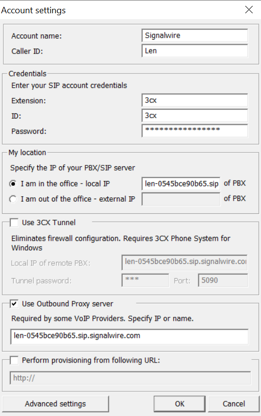
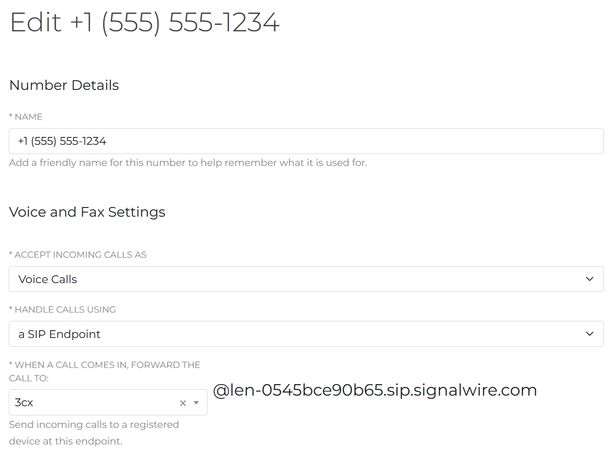
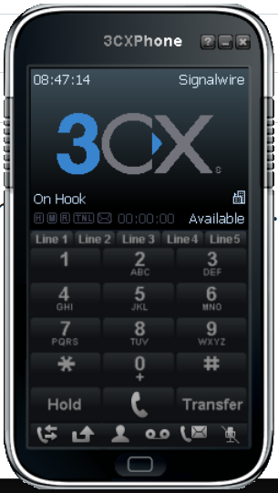

######
3CX
######

Configure a sip endpoint with Signalwire and 3CX Softphone.


Configure
`````````

* Create a sip endpoint from your signalwire space.
* This example will use the the sip endpoint named **3cx**
* Account name: *Signalwire*
* Caller ID: First name Last name
* Extension: **3cx**
* ID: **3cx**
* Password: Signalwire sip endpoint password
* I am in the office - local IP: len-0545bce90b65.sip.signalwire.com

  * This is generated when the sip endpoint credentials are created and is unique to your space.
* Use Outbound Proxy server: len-0545bce90b65.sip.signalwire.com

  * This is generated when the sip endpoint credentials are created and is unique to your space and is the same as above.



Be sure to purchase a phone number and point the number to the sip endpoint that was created.



Once the sip endpoint is registered, **"Available"** will appear on the 3cx softphone.



