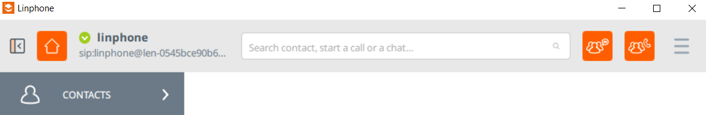
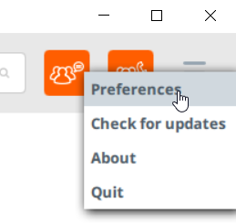
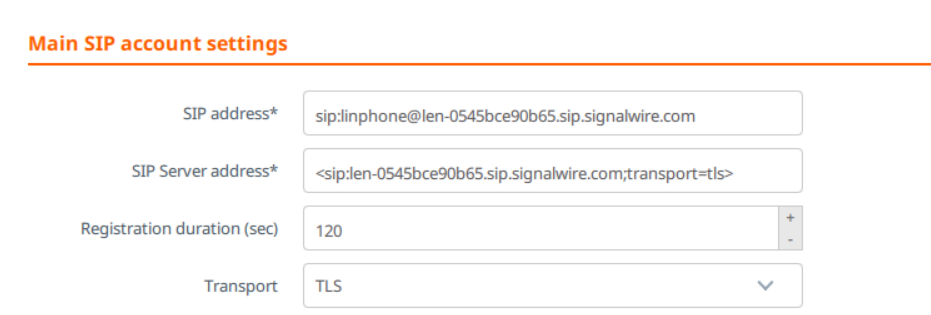
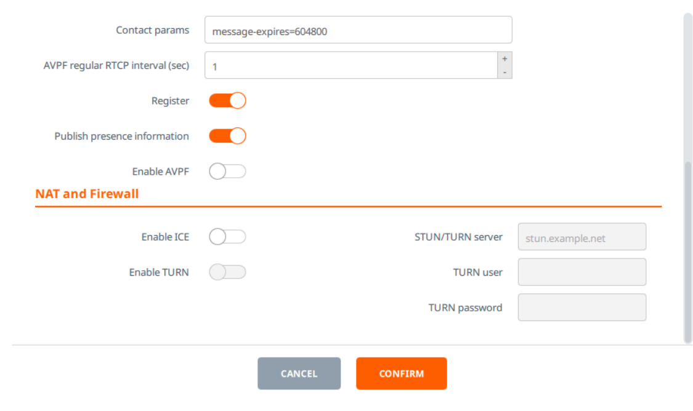
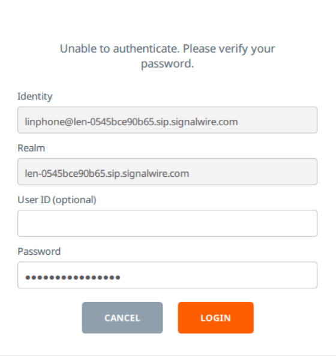

#########
Linphone
#########

Configure a sip endpoint with Signalwire and Linphone Softphone.


Configure
`````````

* Create a sip endpoint from your signalwire space.
* This example will use the the sip endpoint named **linphone**




* Top right hamburger menu click Preferences then Add Account.




* SIP address* sip:linphone@len-0545bce90b65.sip.signalwire.com
* SIP Server address* <sip:len-0545bce90b65.sip.signalwire.com;transport=tls>
* Enable AVPF: Disable this option
* Enable ICE: Disable this option





* If you get this after configuring, enter the sip endpoint password and click Login.



